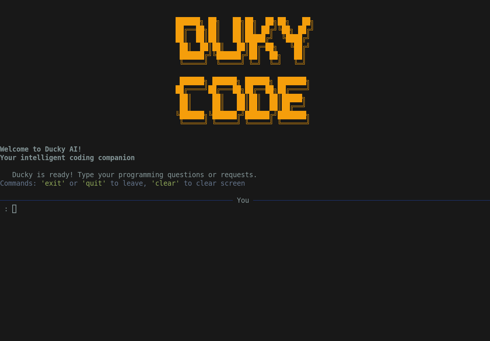

# 🦆 Ducky AI Assistant

Your intelligent terminal-based coding companion, a friendly duck personality!

## ✨ Features

- **Smart AI Integration**: Powered by OpenAI's GPT models
- **Beautiful Terminal UI**: Rich formatting with syntax highlighting
- **Code-Aware**: Automatically detects and formats code blocks
- **Secure**: API keys stored locally and encrypted
- **Duck Personality**: Friendly and helpful assistant
- **Phase 1**: Interactive prompt-response with code copying capabilities

## 🚀 Installation

### Option 1: Install from PyPI (Recommended)
```bash
pip install ducky-ai
```

### Option 2: Install from Source
```bash
git clone https://github.com/HirmaanR/ducky-code.git
cd ducky-ai
pip install -e .
```

### Option 3: Run Directly
```bash
python ducky.py
```

## 📋 Requirements

- Python 3.8 or higher
- AI API key ([Get one here](https://aimlapi.com/app/keys))
- Terminal with color support

## 🛠️ Setup

1. **Install Ducky**:
   ```bash
   pip install ducky-ai
   ```

2. **Run Ducky**:
   ```bash
   ducky
   ```

3. **First Time Setup**:
   - Ducky will ask for your AI/MLAPI API key
   - Key is verified and stored securely in `~/.ducky/config.json`
   - Ready to help with your coding questions!

## 🎯 Usage

### Basic Commands
- Just type your programming questions or requests
- `clear` - Clear the screen
- `exit` or `quit` - Exit Ducky

### Example Interactions
```
🦆 You: How do I create a Python list comprehension?

🦆 Ducky's Response:
A list comprehension is a concise way to create lists in Python...

[code example with syntax highlighting]
```

## 🔧 Configuration

Configuration is stored in `~/.ducky/config.json`:
```json
{
  "api_key": "your-encrypted-api-key",
  "model": "google/gemma-3-27b-it",
  "max_tokens": 2000
}
```

## 🎨 Color Theme

Ducky uses a professional duck-themed color scheme:
- **Primary**: Duck Blue (#1E3A8A)
- **Accent**: Golden Yellow (#F59E0B)
- **Success**: Emerald (#10B981)
- **Error**: Rose (#EF4444)

## 🔮 Roadmap

### Phase 1 ✅
- [x] Terminal-based chat interface
- [x] API integration with OpenAI
- [x] Code block detection and formatting
- [x] Beautiful Rich-based UI
- [x] Secure API key management

### Phase 2 (Coming Soon)
- [ ] File system integration
- [ ] Code modification capabilities
- [ ] Git awareness
- [ ] Project context understanding
- [ ] Multiple AI provider support

## 🐛 Troubleshooting

### Common Issues

**API Key Issues**:
- Make sure your AI/MLAPI API key is valid
- Check your AI/MLAPI account has sufficient credits
- Verify network connection

**Installation Issues**:
- Ensure Python 3.8+ is installed
- Try upgrading pip: `pip install --upgrade pip`
- On some systems, use `pip3` instead of `pip`

**Display Issues**:
- Ensure your terminal supports colors
- Try resizing terminal window
- Some older terminals may not support all Unicode characters

## 🤝 Contributing

Contributions are welcome! Please feel free to submit a Pull Request.

1. Fork the repository
2. Create your feature branch (`git checkout -b feature/AmazingFeature`)
3. Commit your changes (`git commit -m 'Add some AmazingFeature'`)
4. Push to the branch (`git push origin feature/AmazingFeature`)
5. Open a Pull Request

## 📄 License

This project is licensed under the MIT License - see the [LICENSE](LICENSE) file for details.

## 🙏 Acknowledgments

- Inspired by Anthropic's Claude Code
- Built with [Rich](https://github.com/Textualize/rich) for beautiful terminal output
- Powered by google GPT models

---

**Happy Coding with Ducky!**
